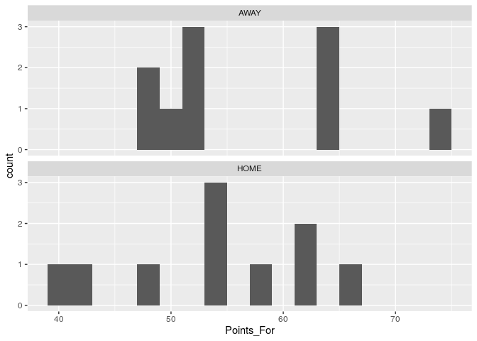

Introduction to Visualizations for EDA
================
John Adams

An essential aspect of exploratory data analysis is visualizing your
data. It allows you to draw conclusions more easily. This document will
walk through a few visualizations you can create to see the story your
data tells.

## Load Tidyverse Library

``` r
library(tidyverse)
```

    ## ── Attaching packages ─────────────────────────────────────── tidyverse 1.3.0 ──

    ## ✓ ggplot2 3.3.2     ✓ purrr   0.3.4
    ## ✓ tibble  3.0.4     ✓ dplyr   1.0.2
    ## ✓ tidyr   1.1.2     ✓ stringr 1.4.0
    ## ✓ readr   1.4.0     ✓ forcats 0.5.0

    ## ── Conflicts ────────────────────────────────────────── tidyverse_conflicts() ──
    ## x dplyr::filter() masks stats::filter()
    ## x dplyr::lag()    masks stats::lag()

``` r
library(readr)
```

## Load the Data

This dataset comes form the Rivers girls basketball team during the
2018-2019 season. It is currently located on Github so you will ask R to
go get the link and convert it to a csv so you can work with it here on
RStudio.

``` r
urlfile="https://raw.githubusercontent.com/jwadams25/high_school_Rstats/master/girls_bball_2018.csv"
RGVB_team <- read.csv(url(urlfile))
```

## Look at the data

Before diving into any visualizations, it’s good to understand the data.
What are the observational unites. What variables are included? What
type of variables are they?

You do not need to look at all of the observations. You can just take
ath the first row so you can first answer the questions listed above. To
get a glipse, you use the code head() and inside the parentheses you
will put the name of the dataset, which in htis case is RGVB\_team

``` r
head(RGVB_team)
```

    ##   Game_Number   Date H_V_A          Opponent Score Points_For Points_Against
    ## 1           1 30-Nov  AWAY Worcester Academy 49-60         49             60
    ## 2          20 27-Feb  AWAY Worcester Academy 52-67         52             67
    ## 3          17  8-Feb  HOME     Tabor Academy 40-50         40             50
    ## 4           7 15-Dec  HOME               TBA 54-55         54             55
    ## 5           6 14-Dec  HOME              WAHS 48-55         48             55
    ## 6          19 15-Feb  HOME             N&GHS 62-44         62             44
    ##   Result Wday_Wend effFG_per TO_per OREB_per DRER_per  FTF  VPS FGM FGA FG_per
    ## 1      L   WeekDay      0.45   0.28     0.29     0.61 0.21 0.86  20  48   0.42
    ## 2      L   WeekDay      0.44   0.23     0.35     0.48 0.35 0.79  18  51   0.35
    ## 3      L   WeekDay      0.35   0.32     0.27     0.66 0.30 0.69  13  46   0.28
    ## 4      L   WeekEnd      0.36   0.20     0.34     0.82 0.46 0.87  16  50   0.32
    ## 5      L   WeekDay      0.39   0.29     0.49     0.50 0.42 0.80  16  48   0.33
    ## 6     W    WeekDay      0.48   0.28     0.49     0.59 0.47 1.21  22  49   0.45
    ##   X2FGM X2FGA X2FG_per X3FGM X3FGA X3FG_per FTM FTA FT_PER PF PA  PPP PPG
    ## 1    17    29     0.59     3    19     0.16   6  10   0.60 49 60 0.77  49
    ## 2     9    26     0.35     9    25     0.36   7  18   0.39 52 67 0.81  52
    ## 3     7    28     0.25     6    18     0.33   8  14   0.57 40 50 0.57  40
    ## 4    12    31     0.39     4    19     0.21  18  23   0.78 54 55 0.83  54
    ## 5    11    32     0.34     5    16     0.31  11  20   0.55 48 55 0.77  48
    ## 6    19    35     0.54     3    14     0.21  15  23   0.65 62 44 0.93  62
    ##   plus_minus MINS TP PoT SCP PiP DREB REB AST TO A.TO TO_per.1 SLOB SLOB_PER
    ## 1        -11   31  8  13   7  28   17  26   7 20 0.35     0.28    4     0.50
    ## 2        -15   31  0  12  10  16   15  28  13 18 0.72     0.23    5     0.20
    ## 3        -10   32  4  12   7  12   25  33   8 25 0.32     0.32    5     0.40
    ## 4         -1   34 10  10  11  22   28  39   6 15 0.40     0.20    5     0.20
    ## 5         -7   31  6  28   7  16   13  31  11 23 0.48     0.29    5     0.40
    ## 6         18   32 25  23   9  34   23  39  12 23 0.52     0.28    7     0.14
    ##   PPSLOB BLOB BLOB_per PPBLOB DEFL STL BLK FOUL CHG
    ## 1   1.00    6     0.33   0.67    5   9   2   16   1
    ## 2   0.40   13     0.62   1.23    9   6   0   18   0
    ## 3   0.40   10     0.30   0.50    8   6   2   18   2
    ## 4   0.20    7     0.57   1.00    6   7   0   17   0
    ## 5   1.00   16     0.38   0.75   12  11   2   20   0
    ## 6   0.29    7     0.29   0.57   14  15   6   15   0

### Questions to Answer:

  - What are the obervational units?
  - How many
  - How many variables does this dataset have?
  - What are three quantitative varibles? Write them out by typing the
    exact label given in the dataset.

## Now that we have an understanding of the data and the types of questions we can explore, let’s start making some visualizations.

## Histogram

A histogram is a great way of seeing the distribution of quantitative
data. Let’s start by analyzing the distribution of the points scored by
the Rivers Girls Varsity Basketball team in each of their games during
the 2018-2019 season. The variable name in the data fram is Points\_For

``` r
points_hist <- RGVB_team %>%
            ggplot(aes(x = Points_For)) +
            geom_histogram()
points_hist
```

    ## `stat_bin()` using `bins = 30`. Pick better value with `binwidth`.

<!-- -->

Now let’s add some labels to your axes and give the histogram a title.
To start, I copied and pasted the code from above and then entered the
code labs(x = “Points Scored”, y = “Number of Games”, title =
“Distribution of Points Scored Per Game By Rivers Girls Basketball”,
subtitle = “2018-2019 Season”)

Note: Anything inside the quotes can be whatever you’d like. Be sure
they are easy to understand and properly represent what appears on the
visualization.

``` r
points_hist <- RGVB_team %>%
            ggplot(aes(x = Points_For)) +
            geom_histogram() +
            labs(x = "Points Scored", 
                 y = "Number of Games", 
                 title = "Distribution of Points Scored Per Game By Rivers Girls Basketball",
                 subtitle = "2018-2019 Season")
points_hist
```

    ## `stat_bin()` using `bins = 30`. Pick better value with `binwidth`.

<!-- -->

You’ll see that a message popped up that says in part “Pick a better
value with ‘binwidth’” Let’s make that change by adding in bindwith = 5
Reference data visualization principles to make an appropriate binwidth
for your analysis.

``` r
points_hist <- RGVB_team %>%
            ggplot(aes(x = Points_For)) +
            geom_histogram(binwidth = 5) +
            labs(x = "Points Scored", y = "Number of Games", title = "Distribution of Points Scored Per Game By Rivers Girls Basketball", subtitle = "2018-2019 Season")
points_hist
```

<!-- -->

### Questions to Answer

#### 1\. Why does changing the binwidth change the look of the picture?

#### 2\. Why would you want to change the binwidth?

To finish let’s set the scales of the x and y axes so that they better
match the binwidth.

add in a line for the median, and change the theme to clean things up a
bit.

``` r
points_hist <- RGVB_team %>%
            ggplot(aes(x = Points_For)) +
            geom_histogram(binwidth = 5, color = "white", fill = "red") +
            labs(x = "Points Scored", 
                 y = "Number of Games", 
                 title = "Distribution of Points Scored Per Game By Rivers Girls Basketball", 
                 subtitle = "2018-2019 Season")  +
            scale_x_continuous(limits = c(0, 90), breaks = seq(0, 90, 5)) +
            scale_y_continuous(limits = c(0, 8), breaks = seq(0, 8, 1)) +
        geom_vline(aes(xintercept = median(Points_For)), color = "black")  
            
points_hist
```

    ## Warning: Removed 2 rows containing missing values (geom_bar).

<!-- -->

### Questions to Answer

#### 1\. You’ll notice that the code scale\_x\_continuous(limits = c(0, 90), breaks = seq(0, 90, 5)) was added. Looking at the histogram that now appears above, what do you think that code does? BE SPECIFIC.

#### 2\. You’ll notice that the code scale\_y\_continuous(limits = c(0, 8), breaks = seq(0, 8, 1)) was added. Looking at the histogram that now appears above, what do you think that code does? BE SPECIFIC.

#### 3\. Write the code you would need if you wanted to change the scale on the x-axis so that it went from 30 to 90 and had breaks every 10.

Adding a vertical line that represents the mean can be helpful to guide
the reader to the center of the data. This is the code that adds in this
line: geom\_vline(aes(xintercept = mean(Points\_For)), color = “black”)

``` r
points_hist <- RGVB_team %>%
            ggplot(aes(x = Points_For)) +
            geom_histogram(binwidth = 5, color = "white", fill = "red") +
            labs(x = "Points Scored", y = "Number of Games", 
                 title = "Distribution of Points Scored Per Game By Rivers Girls Basketball", 
                 subtitle = "2018-2019 Season")  +
            scale_x_continuous(limits = c(0, 90),
                     breaks = seq(0, 90, 5))+
            scale_y_continuous(limits = c(0, 8),
                     breaks = seq(0, 8, 1)) +
        geom_vline(aes(xintercept = mean(Points_For)), color = "black")
points_hist
```

    ## Warning: Removed 2 rows containing missing values (geom_bar).

<!-- -->
\#\#\# Question to answer

#### 1\. If you wanted to add a vertical line for the median instead of the mean, what is the one thing you would want to change in the code above. \*\*hint you just have to change one word

To close out this picture, let’s now change the color and outline of the
bars. Remeber, use styling for a purpose. Often keeping it simple is
best.

In this case, we will fill the bars with red and make the color of the
outline black because it is showing Rivers data.

The code after theme, cleans up the grid lines and background. You can
copy this code into future code you write to create visualizations in
the future.

``` r
points_hist <- RGVB_team %>%
            ggplot(aes(x = Points_For)) +
            geom_histogram(binwidth = 5, color = "black", fill = "red") +
            labs(x = "Points Scored", 
                 y = "Number of Games", 
                 title = "Distribution of Points Scored Per Game By Rivers Girls Basketball", 
                 subtitle = "2018-2019 Season") +
            scale_x_continuous(limits = c(0, 90), breaks = seq(0, 90, 5)) +
            scale_y_continuous(limits = c(0, 8), breaks = seq(0, 8, 1)) +
            geom_vline(aes(xintercept = mean(Points_For)), color = "blue") +
            theme(panel.grid.major = element_blank(), panel.grid.minor = element_blank(), panel.background = element_blank())
points_hist
```

    ## Warning: Removed 2 rows containing missing values (geom_bar).

<!-- -->

## Density Curve

There are times when a density curve will more clearly show the
distribution of quantitative data. Let’s say you are going through your
EDA and create a histogram first and realize a density curve would be a
better visualization: - copy and paste your code - change the name -
change geom\_histogram to geom\_density - delete binwidth = - take out
the scales code for the y-axis - change the y-axis label to y = "".

``` r
points_density <- RGVB_team %>%
            ggplot(aes(x = Points_For)) +
            geom_density(color = "white", fill = "red") +
            labs(x = "Points Scored", y = "", 
                 title = "Distribution of Points Scored Per Game By Rivers Girls Basketball", 
                 subtitle = "2018-2019 Season")  +
            scale_x_continuous(limits = c(0, 90),
                     breaks = seq(0, 90, 5)) +
        geom_vline(aes(xintercept = mean(Points_For)), color = "black")  +
        theme(panel.grid.major = element_blank(), panel.grid.minor = element_blank(), panel.background = element_blank())
            
points_density 
```

<!-- -->
\# Comparing distributions

## Histograms

Histograms stacked on top of one another can be a great way to compare
distributions.

In the histogram below, you will see that I’ve made one histogram for
points scored at home and one for points scored during away games. This
was accomplished by adding the line - facet\_wrap(\~H\_V\_A, nrow = 2,
ncol = 1)

``` r
RGVB_team %>%
        ggplot(aes(x = Points_For)) +
        geom_histogram(binwidth = 2) +
        facet_wrap(~H_V_A, nrow = 2, ncol = 1)
```

<!-- -->

### Question to Answer

#### 1\. If the categorical variable had 3 groups and I wanted to make a histogram for each group, what would I change in the following code?

facet\_wrap(\~H\_V\_A, nrow = 2, ncol = 1)

#### 2\. If you had more data and wanted to make density curves, what would you change in the code above?

## Box Plots

Box plots are another great for comparing distributions. Let’s use them
to compare the points scored during home games vs away games.

``` r
points_HVA_boxes <- RGVB_team %>%
            ggplot(aes(x = H_V_A , y = Points_For)) +
            geom_boxplot() +
            theme_classic()
points_HVA_boxes
```

<!-- -->

We now want to make it easier for our reader to make conclusions.
Therefore, we want to reorder these boxes from the greatest median to
the least. To see this change, look at how code after aes changed.

I also added in some code to change the style.

### Action Iteam

#### To figure out what each new item did you will need to work through the following code by running parts of it at a time.

1.  Start by highlighting from RGVB\_team through 0.3) and then run the
    code by hitting command-option-i on your keyboard. Having done that,
    what does geom\_jitter add to the visualization?

2.  Now highlight from RGVB\_team through “red”)) and then run the code
    by hitting command-option-i on your keyboard. What does the code
    scale\_color\_manual do?

3.  Now highlight from RGVB\_team through color = "") and then run the
    code by hitting command-option-i on your keyboard. What does the
    code labs do?

4.  Now highlight from RGVB\_team through theme\_classic() and then run
    the code by hitting command-option-i on your keyboard. What does the
    code ltheme\_classic() do?

<!-- end list -->

``` r
RGVB_team %>%
        ggplot(aes(x = reorder(H_V_A, Points_For, .desc = TRUE), y = Points_For, color = H_V_A)) +
        geom_boxplot() +
        geom_jitter(alpha = 0.3) +
        scale_color_manual(values = c("black", "red")) +
        labs(title = "Distribution of Points Scored by Rivers Girls Basketball During Home and Away", 
             subtitle = "2018-2019 Season", x = "", y = "Points Scored", color = "") +
        theme_classic()
```

<!-- -->

Sometimes box plots are easier to read when they are stacked on top of
one another. Use coord\_flip to do that. Let’s also add in labels while
we are here. You will do that using the labs code like you did when
making the histograms and density curves.

``` r
flip_points_HVA_boxes <- RGVB_team %>%
            ggplot(aes(x = reorder(H_V_A, Points_For, .desc = TRUE), y = Points_For, color = H_V_A)) +
            geom_boxplot() +
            geom_jitter(alpha = 0.3) +
            scale_color_manual(values = c("black", "red")) +
            labs(title = "Distribution of Points Scored by Rivers Girls Basketball During Home and Away", 
                 subtitle = "2018-2019 Season", 
                 x = "", 
                 y = "Points Scored", 
                 color = "") +
            theme_classic() +
            coord_flip()
flip_points_HVA_boxes
```

<!-- -->
