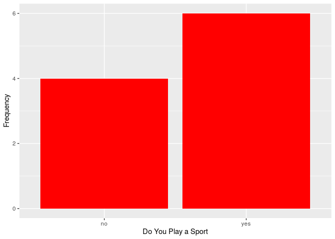
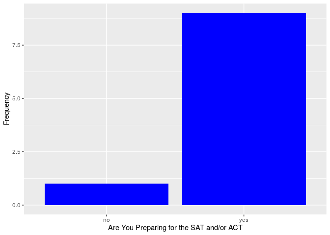
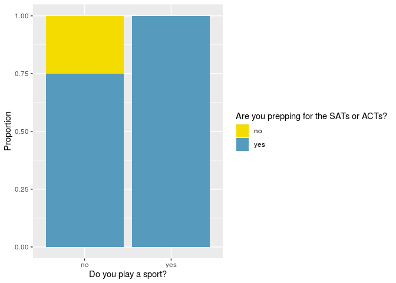

Exploring Categorical Variables Intro
================

\#Always start by running the following code to load the libraries.

# As always, before diving into any questions, make sure you take a look at the dataset.

This is a dataset that was generated by a group during the first part of
the school year.

``` r
urlfile="https://raw.githubusercontent.com/jwadams25/high_school_Rstats/master/Copy%20of%20How%20stressed%20are%20Rivers%20Juniors_%20-%20Sheet1.csv"

stress_juniors <- read.csv(url(urlfile))

head(stress_juniors)
```

    ##   sport instrument honors_ap sat_act_prep  hw club stress_score
    ## 1   yes         no         3          yes 240   30            4
    ## 2    no         no         1          yes 300   60            5
    ## 3   yes         no         2          yes 180   20            4
    ## 4   yes         no         2          yes  90   30            3
    ## 5    no        yes         3          yes  80   80            4
    ## 6   yes         no         1          yes 180   30            3

### Questions to Answer

##### 1\. What are the observational units?

##### 2\. What variables are included?

##### 3\. What type of variables are they?

# From a Dataset to a Table - One Categorical Variable

When exploring a question that involves one categorical variable, you’ll
first want to understand how many observations fall in each category and
what proportion of them fall in each of those categories. Creating a
table is a good first step you can take to do just that.

The code below creates two tables, one for whether or not a student
plays a sport and a second for showing whether or not a student is
preparing for the ACTs or SATs.

You’ll notice, I gave each table a name (sport\_count\_prop and
test\_count\_prop) and then wrote each of those names on their own lines
so when you run the code, the table pops up.

``` r
sport_count_prop <- stress_juniors %>%
                    count(sport) %>%
                    mutate(proportion = n / sum(n)) %>%
                    arrange(desc(proportion))
sport_count_prop
```

    ##   sport n proportion
    ## 1   yes 6        0.6
    ## 2    no 4        0.4

``` r
test_count_prop <- stress_juniors %>%
                    count(sat_act_prep) %>%
                    mutate(proportion = n / sum(n)) %>%
                    arrange(desc(proportion))
test_count_prop
```

    ##   sat_act_prep n proportion
    ## 1          yes 9        0.9
    ## 2           no 1        0.1

### Question to Answer

##### 1\. In the space where the code was written to generate those two tables, create a table showing the counts and proportions for those that play an instrument.

# From a Dataset to a Visualization - One Categorical Variable

While a table can get you the numbers you are looking for and can be a
useful visualization, you may also want to create a bar graph when
looking at a categorical variable. The code below allows you to do that.

``` r
stress_juniors %>%
  ggplot(aes(x = sport)) +
  geom_bar(fill = "red") + 
  labs(x = "Do You Play a Sport", y = "Frequency")
```

<!-- -->

``` r
stress_juniors %>%
  ggplot(aes(x = sat_act_prep)) +
  geom_bar(fill = "blue") + 
  labs(x = "Are You Preparing for the SAT and/or ACT", y = "Frequency")
```

<!-- -->

### Questions to Answer

##### 1\. What code changed the color of the bars?

##### 2\. This time, I have not given them names. Go into the code, give each a name and then write that name on a separate line as well so when you run the code again the bar graphs appear. Be sure the names you provide don’t have spaces, are short, and help you remember what they represent.

##### 3\. In the space above where the code was written to make the two bar graphs, write new code to make a bar graph showing the number of people who do and do not play an instrument.

# Visualizing Relationship Between 2 Categorical Variables

After looking at each of the previous 2 categorical variables in
isolation, the next logical thing to examine is whether there is a
relationship between those two variables. Building a segmented bar
graphs allows you to explore the relationship.

``` r
stress_juniors %>%
ggplot(aes(x = sport, fill = sat_act_prep)) +
  geom_bar(position = "fill") +
  scale_fill_manual(values = c(COL["yellow","full"], COL["blue","full"])) + 
  labs(x = "Do you play a sport?", y = "Proportion", fill = "Are you prepping for the SATs or ACTs?")
```

<!-- -->

### Questions to Answer

##### 1\. What happens if you switch sport and sat\_act\_prep in the part of the code that says aes(x = sport, fill = sat\_act\_prep)?

##### 2\. What happens if you change position = “fill” to position = “dodge”

##### 3\. Which of the two graphs, fill or dodge, would be best in this situation and why?

# From a Dataset to a Table - Two Categorical Variables

## Creating a contigency table to expolore relationship between 2 categorial variables in greater detail.

### Action Item

##### 1\. Before going on, make sure the graph above is the segmented bar graph.

With that graph now shown, you will want to be specific about the size
of each section. In order do to that, you need to create a contigency
table.

``` r
stress_juniors %>%
  count(sport, sat_act_prep) %>% 
  group_by(sport) %>%
  mutate(proportion = n / sum(n)) %>% 
  select(-n) %>%
  pivot_wider(names_from = sport, values_from = proportion)
```

    ## # A tibble: 2 x 3
    ##   sat_act_prep    no   yes
    ##   <chr>        <dbl> <dbl>
    ## 1 no            0.25    NA
    ## 2 yes           0.75     1

You may also want to look at the number of people that fall into each
category.

``` r
stress_juniors %>% 
  count(sport, sat_act_prep) %>% 
  pivot_wider(names_from = sport, values_from = n)
```

    ## # A tibble: 2 x 3
    ##   sat_act_prep    no   yes
    ##   <chr>        <int> <int>
    ## 1 no               1    NA
    ## 2 yes              3     6

# Advanced Styling Options

## One Categorical Variable

For these demostrations we will use the data in the openintro packaged
called immigration. This is the data used in the questions \#2 done for
homework in the following section of Introduction to Modern Statistics -
<https://openintro-ims.netlify.app/summarizing-visualizing-data.html#explore-categorical-data-exercises>
Read here for more information about the dataset -
<http://openintrostat.github.io/openintro/reference/immigration.html>

``` r
head(immigration)
```

    ## # A tibble: 6 x 2
    ##   response              political   
    ##   <fct>                 <fct>       
    ## 1 Apply for citizenship conservative
    ## 2 Apply for citizenship conservative
    ## 3 Apply for citizenship conservative
    ## 4 Apply for citizenship conservative
    ## 5 Apply for citizenship conservative
    ## 6 Apply for citizenship conservative

Let’s start by seeing a breakdown of the number of people in each
political affiliation in the sample of 910 registered voters in Tampa
Florida. Like we did before, we’ll make a table and a bar graph to do
that.

This time, however, we will arrange the table and graph from greatest to
least (descending order). I’ll also use the code coord\_flip() to make
the bars appear horizontally. These changes can help makes it much
easier to draw conclusions.

``` r
political_table <- immigration %>%
                    count(political) %>%
                    mutate(proportion = n / sum(n)) %>%
                    arrange(desc(proportion))


political_table
```

    ## # A tibble: 3 x 3
    ##   political        n proportion
    ##   <fct>        <int>      <dbl>
    ## 1 conservative   372      0.409
    ## 2 moderate       363      0.399
    ## 3 liberal        175      0.192

``` r
# When making this new bar graph, we'll want to reference the table we just created. Therefore, where you tyically write the name of the dataset you will write political_count because that is the name of our new dataset. 

political_bar_order <- immigration %>%
  ggplot(aes(x = fct_rev(fct_infreq(political)), fill = political)) +
  geom_bar() +
  theme_minimal() +
  coord_flip() +
  labs(x = "", 
       y = " Political Affiliation", 
       title = "Political Affiliations of Registered Votes in Tampa, Florida", 
       subtitle = "Based on a random sample of 910 registred voters in Tampa, Florida") +
  scale_fill_manual(values = c("red","navy", "gray")) +
  theme(legend.position = "none")

political_bar_order 
```

<!-- -->
\#\#\# Questions to Answer

##### 1\. Reference the code above to make a table and bar graph for the response variable. Be sure the table lists proportions from greatest to least. For the bar graph, be sure each the bars are orered from least go greatest and all of other styling added to the graph above is included. \*Hint: Be sure you add colors\!
