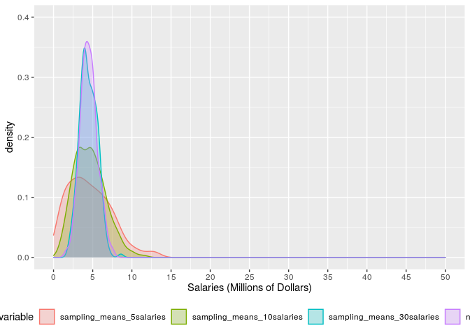

Key - CLT Exploration with MLB Salaries
================
Mr. Adams

# MLB Salaries and CLT Exploration

\#\#\#Libraries As always, run the libraries before you begin.

``` r
library(gtools)
library(reshape2)
library(gridExtra)
library(tidyverse)
```

    ## ── Attaching packages ─────────────────────────────────────── tidyverse 1.3.0 ──

    ## ✓ ggplot2 3.3.2     ✓ purrr   0.3.4
    ## ✓ tibble  3.0.4     ✓ dplyr   1.0.2
    ## ✓ tidyr   1.1.2     ✓ stringr 1.4.0
    ## ✓ readr   1.4.0     ✓ forcats 0.5.0

    ## ── Conflicts ────────────────────────────────────────── tidyverse_conflicts() ──
    ## x dplyr::combine() masks gridExtra::combine()
    ## x dplyr::filter()  masks stats::filter()
    ## x dplyr::lag()     masks stats::lag()

``` r
library(readr)
```

## Load the Data

Run the following code to get the data. Note that mlb is short for major
league baseball. The data comes from the 2019 season and was collected
from <https://www.usatoday.com/sports/mlb/salaries/2019/player/all/>

\#\#\#\#The name of the dataset for the population is named mlb

``` r
mlb <- read_csv("https://raw.githubusercontent.com/jwadams25/Rivers_Statistics_With_R/main/4%20-%20Data/MLB_Salaries_2019.csv")
```

    ## 
    ## ── Column specification ────────────────────────────────────────────────────────
    ## cols(
    ##   RANK = col_double(),
    ##   NAME = col_character(),
    ##   TEAM = col_character(),
    ##   POS = col_character(),
    ##   SALARY = col_number(),
    ##   salary = col_double(),
    ##   YEARS = col_character(),
    ##   TOTAL_VALUE = col_number(),
    ##   AVG_ANNUAL = col_character()
    ## )

# Part 1 - Explore the Population

\#\#\#Start by making a density curve to show the distribution of All of
the Major League Baseball players’ yearly salary in 2019. Throughout
this activity, you will see CHANGE. Anytime you see CHANGE, you will
have to change it before running the code.

Change the code below in order to ensure that this code selects the mlb
dataframe, makes the x axis with the salary variable, and fills the
density curve with the color of your choice.

``` r
population_density <- mlb %>%
  ggplot(aes(x = salary)) +
  geom_density(fill= "red", alpha = 0.5) + 
  labs(x = "Salaries (Millions)")
population_density
```

<!-- -->

### Generate a few summary statistics of the salary variable in order to get a more specific understanding of the POPULATION distribution.

``` r
pop_mean_sd_med_iqr <- mlb %>%
  summarize(population_mean = mean(salary),
            population_sd = sd(salary),
            population_median = median(salary),
            iqr_middle_50 = IQR(salary), 
            p_25 = quantile(salary,.25),
            p_75 = quantile(salary,.75))
pop_mean_sd_med_iqr
```

    ## # A tibble: 1 x 6
    ##   population_mean population_sd population_median iqr_middle_50  p_25  p_75
    ##             <dbl>         <dbl>             <dbl>         <dbl> <dbl> <dbl>
    ## 1            4.51          6.33               1.4          5.43 0.570     6

#### Question 1:

##### Before going to part 2, record the population mean, standard deviation, and median and then write a description of the distribution of all MLB salaries. Be sure to comment on the shape, center, and spread of the distribution.

Players’ salaries are skewed to the right, meaning there are a few
players that earn a lot of money and most are closer to the median
salary of 1.4 million dollars. More specifically, 75 percent of salaries
are less than 6 million dollars.

# Part 2 - Taking Samples from a Population

## Part 2a - You will start by taking 1 random sample of 5 salaries from the population and then calculate the mean of those 5 salaries we selected.

``` r
sample_of_salaries <-  sample(mlb$salary, 5, replace = FALSE)
sample_of_salaries
```

    ## [1]  9.00 10.67  0.56  1.00 13.00

``` r
mean(sample_of_salaries)
```

    ## [1] 6.846

#### Question 2:

##### Do you think each of your classmates got the same 5 numbers as you? Explain why or why not.

#### Question 3:

##### Do you think your classmates got the same mean after running this code? Explain why or why not.

### A reasonable question to ask at this point is: Why would you want to take a sample if you have all of the MLB Salaries?

Typically, you won’t have the data from the entire population, therefore
you will have to analyze data from a sample. Therefore, in this
activity, you will learn about the distribution of sample means. In
other words, if you take a bunch of samples and recorded the mean each
time, what will the distributions of those means look like? You’ll also
examine how the sample size affects the distribution of sample means. By
having the entire population, you can compare our distributions to the
entire population.

#### Here we go.

## Part 2a: Randomly sample a group of 5 salaries and repeat 200 times

This time you will do the same thing you did earlier (take a sample of 5
salaries and calculate the mean), but you will now repeat the process
200 times. You will then produce a density curve showing the
distribution of the 200 sample means and calculate the mean and standard
deviation of the 200 sample means.

##### Let’s run this simulation

Start with a sample size of 5. That means we take a sample of 5
salaries, calculate the mean of those 5, and then repeat that process
200 times.

``` r
set.seed(231)
sampling_means_5salaries <- replicate(200,{ 
 salary_choice5 <- sample(mlb$salary, 5, 
          replace = FALSE)
  mean(salary_choice5)})

s_mean_5_x_200 <- data_frame(sampling_means_5salaries)
```

    ## Warning: `data_frame()` is deprecated as of tibble 1.1.0.
    ## Please use `tibble()` instead.
    ## This warning is displayed once every 8 hours.
    ## Call `lifecycle::last_warnings()` to see where this warning was generated.

``` r
s_mean_5_x_200
```

    ## # A tibble: 200 x 1
    ##    sampling_means_5salaries
    ##                       <dbl>
    ##  1                    10.7 
    ##  2                     9.94
    ##  3                     3.15
    ##  4                     7.93
    ##  5                     3.76
    ##  6                     6.76
    ##  7                     1.91
    ##  8                     1.73
    ##  9                     1.97
    ## 10                     1.16
    ## # … with 190 more rows

#### Question 4:

##### You just created a dataset.

##### a. What is the name of the new dataset you just created? Write the exact name. It will help you later.

s\_mean\_5\_x\_200

##### b. What is the name of the variable in that new dataset? Write the exact name. It will help you later.

sampling\_means\_5salaries

##### c. How many rows are in the dataset?

200

##### d. What does each row represent?

A sample mean from a sample of 5 salaries.

Check with Mr. Adams before going on.

##### Let’s visualize and summarize the distribution of means generated in this simulation

Ok. Now that you understand basics of the dataset, let’s learn more
about it. Use the space below to generate a histogram and summary
statistics of the data recorded for the sampling\_means\_5salaries
variable from the s\_mean\_5\_x\_200 dataset. \*\*\*HINT: Use code
you’ve done before or even code included already included in this
worksheet. Use your answers in parts a and b of question 4. You do not
need to go wild with styling of the histogram.

``` r
s_mean_5_x_200 %>%
ggplot(aes(x = sampling_means_5salaries)) +
  geom_histogram(color = "red", binwidth = 0.5)
```

<!-- -->

``` r
s_mean_5_x_200 %>%
  summarize(mean = mean(sampling_means_5salaries),
            sd = sd(sampling_means_5salaries),
            median = median(sampling_means_5salaries),
            iqr_middle_50 = IQR(sampling_means_5salaries), 
            p_25 = quantile(sampling_means_5salaries,.25),
            p_75 = quantile(sampling_means_5salaries,.75))
```

    ## # A tibble: 1 x 6
    ##    mean    sd median iqr_middle_50  p_25  p_75
    ##   <dbl> <dbl>  <dbl>         <dbl> <dbl> <dbl>
    ## 1  4.63  2.76   4.30          4.13  2.46  6.59

#### Question 5:

##### Describe the shape, center, and spread of the distribution you just created.

## Part 2c - Randomly sample a group of 10 salaries and repeat 200 times

For our second simulation, you will use a sample size of 10. That means
we take a sample of 10 salaries, calculate the mean of those 10, and
then repeat that process 200 times.

``` r
sampling_means_10salaries <- replicate(200,{ 
 salary_choice10 <- sample(mlb$salary, 10, 
          replace = FALSE)
  mean(salary_choice10)})

s_mean_10_x_200 <- data_frame(sampling_means_10salaries)
s_mean_10_x_200
```

    ## # A tibble: 200 x 1
    ##    sampling_means_10salaries
    ##                        <dbl>
    ##  1                      9.85
    ##  2                      3.48
    ##  3                      6.2 
    ##  4                      6.99
    ##  5                      4.48
    ##  6                      3.32
    ##  7                      8.14
    ##  8                      3.10
    ##  9                      2.21
    ## 10                      7.68
    ## # … with 190 more rows

##### Let’s visualize and summarize the distribution of means generated in this simulation

Use the space below to generate a histogram and summary statistics for
the data recorded for the sampling\_means\_10salaries variable from the
s\_mean\_10\_x\_200 dataset. \*\*\*HINT: Use code you’ve done before or
even code included already included in this worksheet. Use your answers
in parts a and b of question 4. You do not need to go wild with styling
of the histogram.

``` r
s_mean_10_x_200 %>%
ggplot(aes(x = sampling_means_10salaries)) +
  geom_histogram(color = "green", binwidth = 0.5)
```

<!-- -->

``` r
s_mean_10_x_200 %>%
  summarize(mean = mean(sampling_means_10salaries),
            sd = sd(sampling_means_10salaries),
            median = median(sampling_means_10salaries),
            iqr_middle_50 = IQR(sampling_means_10salaries), 
            p_25 = quantile(sampling_means_10salaries,.25),
            p_75 = quantile(sampling_means_10salaries,.75))
```

    ## # A tibble: 1 x 6
    ##    mean    sd median iqr_middle_50  p_25  p_75
    ##   <dbl> <dbl>  <dbl>         <dbl> <dbl> <dbl>
    ## 1  4.63  1.97   4.56          2.80  3.14  5.93

#### Question 6:

##### Compare this this distribution to the one you created when taking samples of 5.

## Part 2c - More Simulations

In this section, we will conduct two more simulations, but hold off on
visualizing the distribution and generating the summary statistics.
Later on in the worksheet, you will project the distributions of all
simulation on the same axes and calculate the summary statistics all at
once.

##### Randomly sample a group of 10 salaries and repeat 200 times

Now try a sample size of 30. That means we take a sample of 30 salaries,
calculate the mean of the 30, and then repeat that process 200 times.

``` r
sampling_means_30salaries <- replicate(200,{ 
 salary_choice30 <- sample(mlb$salary, 30, 
          replace = FALSE)
 mean(salary_choice30)})
```

##### Now create a normal distribution with the same mean and standard deviation as the distribution of sample means when the sample size was 30.

There is nothing to change in this code. Just run it.

``` r
norm_30 <- rnorm(sampling_means_30salaries, mean = mean(sampling_means_30salaries), 
                 sd = sd(sampling_means_30salaries))
```

# Part 3: Create a new data frame and Compare Simulations

Now you will join all the four distributions together to make a data
frame that has 4 columns, one for each distribution of sample means and
a column for the normal distribution you created.

There is nothing to change in this code. Just run it.

``` r
sample_salaries <- data_frame(sampling_means_5salaries, sampling_means_10salaries, 
                              sampling_means_30salaries, norm_30)
```

##### Making Comparisons

Let’s compare the distribution of sample means for each sample size
using 4 density curves.

``` r
sampling_means_density <- melt(sample_salaries) %>%
  ggplot(aes(x = value, fill = variable, color = variable)) +
  geom_density(alpha = 0.25) +
    scale_x_continuous(limits = c(0, 50),
                     breaks = seq(0, 50, 5)) +
  scale_y_continuous(limits = c(0, 0.4),
                     breaks = seq(0, 0.4, 0.1)) + 
  labs(x = "Salaries (Millions of Dollars)") +
  theme(legend.position="bottom") 
```

    ## No id variables; using all as measure variables

``` r
sampling_means_density
```

<!-- -->

#### Question 7:Each distribution shows the distribution of s\_\_\_\_\_\_\_\_\_ m\_\_\_\_\_.

#### Question 8:Which two distributions have you already described?

#### Question 9: Using the visualization above answer the following:

What do you notice?

What do you wonder?

What is going on? Write a catchy headline for this visualization.

### Compare the Density Curves

To see how these sampling distributions of sample means relate to the
population, we can compare the density curves. This is the same density
curve you created at the start of the activity, but you need to adjust
the scales on the x and y axes in order to properly compare the
distributions.

``` r
pop_density <- mlb %>%
  ggplot(aes(x = salary)) +
  geom_density(fill= "lavender")+
    scale_x_continuous(limits = c(0, 50),
                     breaks = seq(0, 50, 10)) +
  scale_y_continuous(limits = c(0, 0.5),
                     breaks = seq(0, 0.5, 0.1)) + 
  labs(x = "Salaries (Millions of Dollars)") +
  geom_vline(aes(xintercept = mean(salary)), color = "red", size = 1.25)

#This code will put position both density curves directly on top of one another. 

grid.arrange(pop_density, sampling_means_density, nrow = 2, ncol = 1)
```

<!-- -->

### Summary Statistics for Sampling Distribution of Sample Means

``` r
melt(sample_salaries) %>%
  group_by(variable) %>%
  summarize(mean_of_sample_means = mean(value),
            sd_of_sample_means = sd(value))
```

    ## No id variables; using all as measure variables

    ## `summarise()` ungrouping output (override with `.groups` argument)

    ## # A tibble: 4 x 3
    ##   variable                  mean_of_sample_means sd_of_sample_means
    ##   <fct>                                    <dbl>              <dbl>
    ## 1 sampling_means_5salaries                  4.63               2.76
    ## 2 sampling_means_10salaries                 4.63               1.97
    ## 3 sampling_means_30salaries                 4.45               1.09
    ## 4 norm_30                                   4.50               1.08

#### Question 10: What happens to the spread of the distribution as the sample means came from a larger sample size?

#### Question 11: The distribution of sample means when n = 30, is centered around the \_\_\_\_\_\_\_\_\_\_\_\_\_\_\_\_.(hint: look at the vertical red line)

#### Question 12: Based on this exploration, which sample size will give you the best estimate of the population mean? What is a sample size that could give an even better estimate. Explain.

# Part 4 Putting the Central Limit Theorem to Work

To this point, we created simulations.

The Central Limit Theorem says the distribution of sample means has the
following properties:

1.  Shape: Normal
2.  Center = population mean
3.  Spread = sigma/square root of n

## We will use the following exercises to do calculations and make conclusions using the Central Limit Theorem.

## Part 4a - Compare CLT to Simulations

#### Question 13: In one of the above simulations you created a distribution of sample means with a sample size(n) = 30 and then calculated the mean and standard deviation of that distribution. Record those below. Be sure to label them ie don’t just write the numbers.

#### Question 14: Record the population mean and standard deviation below. Again, be sure to label them ie don’t just write the numbers.

#### Questions 15: Using the central limit theorem, find the shape, center, and spread of the frequecy distribution of sample means when n = 30. When done, comment on how these numbers compare to the simulation.

Shape:

Center:

Spread:

Your commentary on the relationship between what you us calculated and
the numbers generated from the simulation (n=30).

Remember you can use R as a calculator.

``` r
pop_mean <- mean(mlb$salary)
pop_sd <- sd(mlb$salary)
standard_error_30 <- sd(mlb$salary)/sqrt(30)
standard_error_30 
```

    ## [1] 1.156392

## Part 4b - Making predictions about samples.

In keeping with the spirit of Naked Statistics, this part of the
worksheet is the part where LeBron comes down on a breakaway and throws
down that trademark massive one handed slam (not against the Celtics of
course because Taco would stuff him!!)

#### The story: Your friend comes to you and says, “Hey, I just went online and found a random sample of 100 Major League Baseball salaries from 2019. I learned that the average is…” Before he finishes, you stop him. You, having just learned about the distribution of ALL major league baseball players’ salaries from that same year and about the Central Limit Theorem, are confident you can use your knowledge to make and win a bet with your friend. You say to your friend, “I’ll bet you $5 that the average you got is between \_\_\_\_\_\_\_\_\_\_\_\_ and \_\_\_\_\_\_\_\_\_\_\_\_?”

#### Your Final Task: Use the central limit theorem and your understanding of the emprical rule, to figure out what values should be inserted into that sentence where you propose a bet to your friend.

Show your work in the space below.

``` r
standard_error_100 <- pop_sd/sqrt(100)
standard_error_100
```

    ## [1] 0.6333822

``` r
lower <- pop_mean-(2*standard_error_100)
upper <- pop_mean +(2*standard_error_100)

lower
```

    ## [1] 3.244102

``` r
upper
```

    ## [1] 5.777631
